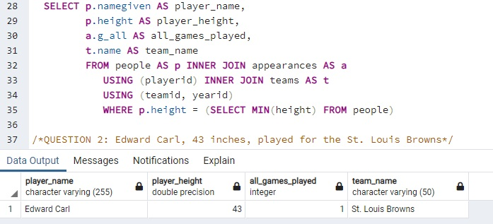
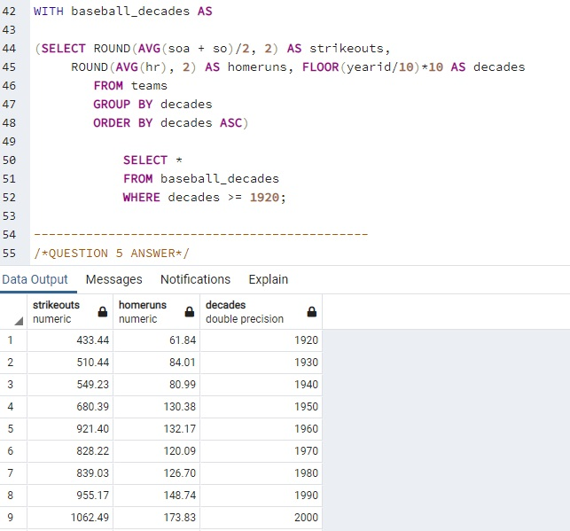
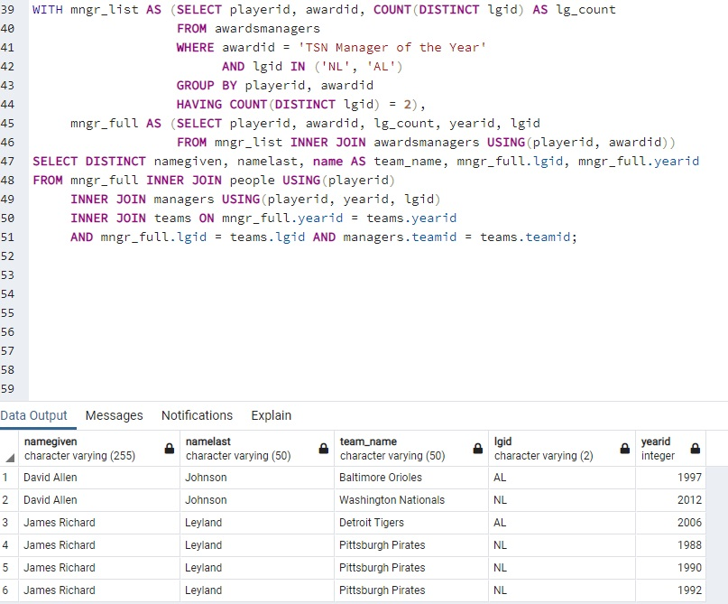

# lahman-baseball-project

# Introduction
Our team was given Lahman's Baseball Database, and we were tasked with analyzing the data and reporting back any interesting findings. There were a total of 9 main questions and I was assigned questions 2, 5, and 9. There were a total of 27 tables, and for this project our team used PostgreSQL.

Data Sources:  [Lahman's Baseball Database](http://www.seanlahman.com/baseball-archive/statistics/) 
[Lahman's Baseball ERD](http://www.seanlahman.com/files/database/readme2016.txt)

# Table of Contents
* [Introduction](#Introduction)
* [SQL Walkthrough](#SQL-Walkthrough)

# SQL Walkthrough

1. For question 2, I was asked to find the name and height of the shortest player in the database along with how many games he played in and what team he was on.

2. I start the query by using the `FROM` statement to select the tables I need to `INNER JOIN` to find my answer. I'm able to join the tables with the `USING` statement because the keys are the same for each table. I then use `SELECT` to get the player name, player height, all games played, and team name from each respective table.
Lastly, I use the `WHERE` statement with a subquery to only return the player with the minimum height from the people table.

3. For question 5 I needed to find the average number of strikeouts per game by decade since 1920 and round 2 decimal places, along with finding the average number of home runs per game by decade.

4. I start the query by using the `FROM` statement to select the tables needed to find my answer. There were two columns of strikeouts, one for batters and one for pitchers. I needed to add both columns together, find the average, round the decimal points and divide by two to get the correct amount of strikeouts.

5. For each decade I used a simple formula, where `FLOOR` will return the largest integer value that is equal to or less than the integer specified, and divided the year id by ten and then multiplied by ten to get each decade. I wrap this query in a `CTE` to limit the result to only decades after the 1920s.

6. For question 9 I was asked to find which managers had won the TSN Manager of the Year award in both the National League and the Americal League, along with their full name and the teams they were managing when they won the award.

7. This query required a couple of CTEs to work properly. Starting by using `FROM` to get the correct table. From there I use the `WHERE` statement to filter the output to only include people who have won the TSN Manager award. Then I select the player id, award id, and count of distinct league id.

8. After the first query was made, I needed to create another query that merged the first table with another table that was specifically for manager awards.

9. Lastly, I created the final query which took each `DISTINCT` name, last name, team name, league id, and year id. From there I inner joined the manager full, people, managers, and teams tables to finally find the managers that won the TSN Manager award in both leagues.

